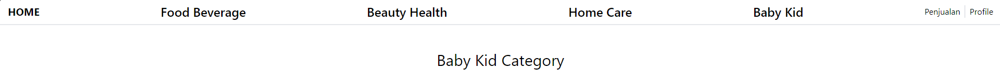

## SOAL PRAKTIKUM
Project ini merupakan sebuah soal praktikum dari jobsheet 2, lanjutan dari [PWL_2024](https://github.com/Fahridanaa/PWL_2024)

### Code
#### 1. Controller
* HomeController.php
```php
<?php
namespace App\Http\Controllers;
class HomeController extends Controller {
    public function home() {
        return view('home');
    }
}
```
* CategoryController.php
```php
<?php
namespace App\Http\Controllers;
use Illuminate\Http\Request;

class CategoryController extends Controller
{
    public function show($category)
    {
        $categoryView = 'products.' . lcfirst(str_replace('-', '', ucwords($category, '-')));

        if (!view()->exists($categoryView)) {
            abort(404, 'Page not found');
        }

        return view($categoryView);
    }
}
```
* UserProfileController
```php
<?php

namespace App\Http\Controllers;

use Illuminate\Http\Request;

class UserProfileController extends Controller
{
    public function show($id, $name) {
        return view('users.profile')
                    ->with('id', $id)
                    ->with('name', $name);
    }
}
```
* SalesPageController
```php
<?php

namespace App\Http\Controllers;

use Illuminate\Http\Request;

class SalesPageController extends Controller
{
    public function show() {
        return view('transactions.transaction');
    }
}
```

#### 2. Views

1. Layout
    ```html
    <!doctype html>
    <html lang="en">
    <head>
        <meta charset="UTF-8">
        <meta name="viewport"
              content="width=device-width, user-scalable=no, initial-scale=1.0, maximum-scale=1.0, minimum-scale=1.0">
        <meta http-equiv="X-UA-Compatible" content="ie=edge">
        @vite('resources/css/app.css')
        <title>Toko Uhuy</title>
    </head>
    <body>
        @yield('content')
    </body>
    </html>
    
    ```
   
2. Navbar
    ```html
    <?php
    $categories = [
        ['name' => 'Food Beverage', 'link' => '/category/food-beverage'],
        ['name' => 'Beauty Health', 'link' => '/category/beauty-health'],
        ['name' => 'Home Care', 'link' => '/category/home-care'],
        ['name' => 'Baby Kid', 'link' => '/category/baby-kid']
    ];
    ?>
    
    <style>
        .hover-effect::after {
            content: "";
            position: absolute;
            left: 0;
            bottom: 0;
            width: 100%;
            height: 2px;
            transform-origin: left center;
            transform: scaleX(0);
            background-color: currentColor;
            transition: transform 0.3s ease-out;
            will-change: transform;
        }
        .hover-effect:hover::after {
            transform: scaleX(.8);
        }
    </style>
    <div class="flex border-b-2 justify-between items-center px-4 py-2 sticky">
        <h1 class="text-xl font-bold"><a href={{url('/')}}>HOME</a></h1>
        <ul id="categories" class="flex flex-auto justify-evenly">
            @foreach($categories as $category)
                <li class="font-medium text-2xl relative overflow-hidden hover-effect"><a href="{{ url($category['link']) }}">{{ $category['name'] }}</a></li>
            @endforeach
        </ul>
        <div class="flex ml-auto">
            <button class="border-r-2 pr-2">
                <a href="{{ url('/transaction') }}"  class="btn btn-primary">Penjualan</a>
            </button>
            <button class="ml-2">
                <a href="{{ url('/user/1/name/Fahri') }}"  class="btn btn-primary">Profile</a>
            </button>
        </div>
    </div>
    ```
   
3. Home
    ```php
    @extends('layouts.app')
    @section('content')
        <div class="min-h-screen flex flex-col">
            @component('components.navbar')
            @endcomponent
            <div class="flex-auto flex justify-center items-center">
                <h1 class="text-7xl text-center">Selamat Datang di Toko Uhuy</h1>
            </div>
        </div>
    @endsection
    ```
   
4. Products
   1. foodBeverage
        ```php
        @extends('layouts.app')
        @section('content')
            <div class="min-h-screen flex flex-col">
                @component('components.navbar')
                @endcomponent
                <div class="mx-auto my-12">
                    <h1 class="text-3xl text-center">Food Beverage Category</h1>
                </div>
            </div>
        @endsection
        ```
   2. beautyHealth
        ```php
        @extends('layouts.app')
        @section('content')
            <div class="min-h-screen flex flex-col">
                @component('components.navbar')
                @endcomponent
                <div class="mx-auto my-12">
                    <h1 class="text-3xl text-center">Beauty Health Category</h1>
                </div>
            </div>
        @endsection
        ```
   3. homeCare
        ```php
        @extends('layouts.app')
        @section('content')
            <div class="min-h-screen flex flex-col">
                @component('components.navbar')
                @endcomponent
                <div class="mx-auto my-12">
                    <h1 class="text-3xl text-center">Home Care Category</h1>
                </div>
            </div>
        @endsection
        ```
   4. babyKid
         ```php
         @extends('layouts.app')
         @section('content')
             <div class="min-h-screen flex flex-col">
                 @component('components.navbar')
                 @endcomponent
                 <div class="mx-auto my-12">
                     <h1 class="text-3xl text-center">Baby Kid Category</h1>
                 </div>
             </div>
         @endsection
         ```
      
5. Profile
    ```php
    @extends('layouts.app')
    @section('content')
        @component('components.navbar')
        @endcomponent
        <div class="my-12">
            <h1 class="text-3xl text-center">Hai, {{ $name }}. ID mu adalah {{ $id }}</h1>
            <h1 class="text-sm text-center">(coba untuk merubah url)</h1>
        </div>
    @endsection
    ```
   
6. Transaction
    ```php
    @extends('layouts.app')
    @section('content')
        <div class="min-h-screen flex flex-col">
            @component('components.navbar')
            @endcomponent
            <div class="mx-auto my-12">
                <h1 class="text-3xl text-center">Halaman Transaksi</h1>
            </div>
        </div>
    @endsection
    ```


#### 4. OUTPUT

1. /
    > 
2. Category
   1. /category/food-beverage
      > 
   2. /category/beauty-health
      > 
   3. /category/home-care
      > 
   4. /category/baby-kid
      > 
3. /transaction
    > 
4. /user/{id}/name/{name}
    > 
